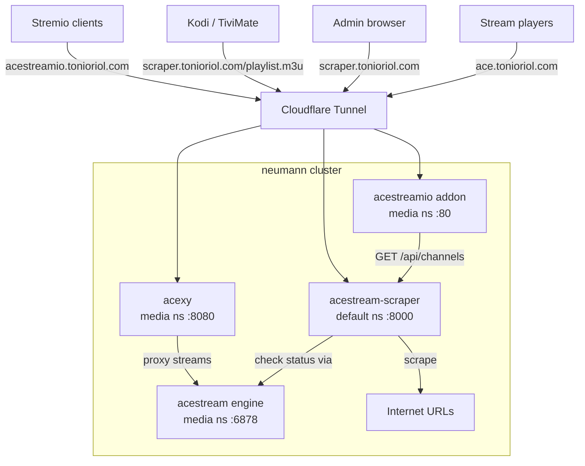

# Acestream Scraper Integration

## TASK

Deploy acestream-scraper as a channel discovery + health checking service alongside the existing acestream stack. Connect the acestreamio Stremio addon to fetch channels from the scraper API instead of a static list. Expose services via Cloudflare Tunnel with token-gated auth.

## GENERAL CONTEXT

See `ritchie/AGENTS.md` for full cluster/project layout.

### REPO

- `ritchie/` — GitOps config (Helm charts, ArgoCD apps)
- `acestream-scraper/` — Fork of `pipepito/acestream-scraper` with custom overlay
- `acestreamio/` — Stremio addon

### RELEVANT FILES

* `ritchie/charts/acestream-scraper/` — Helm chart
* `ritchie/charts/acexy/` — Acexy proxy Helm chart
* `ritchie/charts/acestreamio/` — Stremio addon Helm chart
* `ritchie/charts/acestream/` — Acestream engine + proxy Helm chart
* `ritchie/charts/cloudflared/values.yaml` — Tunnel routing
* `ritchie/apps/acestream-scraper.yaml` — ArgoCD Application
* `ritchie/apps/acexy.yaml` — ArgoCD Application
* `ritchie/apps/acestreamio.yaml` — ArgoCD Application
* `acestream-scraper/app/` — Custom overlay code
* `acestreamio/addon.js` — Stremio addon (fetches from scraper API)

## Architecture

### Data flow

1. **Scraper** periodically fetches configured URLs, extracts acestream infohashes + metadata
2. **Health checker** probes each infohash via acestream engine (`acestream.media.svc.cluster.local:6878`)
3. **Store** persists channels with status in SQLite (`/app/config/acestream_scraper.db`, PVC-backed)
4. **API** serves channel list to acestreamio addon and M3U playlists
5. **Acexy** proxies stream requests with token auth at `ace.tonioriol.com`
6. **Addon** fetches channels from scraper API, groups by `channel_name` for Stremio UX

### Auth chain

All three services share the same password from 1Password (`neumann` vault / `acestream-scraper` item):
- `acestream-scraper`: HTTP Basic Auth + `?token=` query param (`AUTH_USERNAME` + `AUTH_PASSWORD`)
- `acexy`: `?token=` query param (`ACEXY_TOKEN`)
- `acestreamio`: `STREAM_TOKEN` for Stremio stream URL auth

Secrets injected via External Secrets Operator → 1Password Connect.

## PLAN

- ✅ Fork `pipepito/acestream-scraper` to `tonioriol/acestream-scraper`
- ✅ Create custom overlay in `app/` with auth, config API, services
- ✅ Create Helm chart `charts/acestream-scraper/` with PVC, ExternalSecret, configmap
- ✅ Deploy acestream-scraper via ArgoCD (`default` namespace)
- ✅ Configure scraping sources and `ace_engine_url`
- ✅ Deploy Acexy as standalone Go proxy (`media` namespace)
- ✅ Expose scraper + Acexy + addon via Cloudflare Tunnel
- ✅ Set up CI/CD with semantic-release + ArgoCD Image Updater for both repos
- ✅ Connect acestreamio addon to scraper API
- ✅ Set up 1Password Connect + ESO for secret management
- ⬜ Remove legacy static `list.js` from acestreamio (if still present)
- ⬜ Rename `acestream` chart to `acestream-engine` for clarity

## EVENT LOG

* **2026-02-17 - Initial acestream-scraper deployment**
  * Why: Need dynamic channel discovery instead of static list
  * How: Created Helm chart, ArgoCD app, deployed to `default` namespace

* **2026-02-18 - Data quality improvements and auth**
  * Why: Needed auth for public exposure, better channel data
  * How: Added HTTP Basic + token auth, ExternalSecret from 1Password

* **2026-02-19 - Acexy standalone deployment + Cloudflare Tunnel GitOps**
  * Why: Separate stream proxy from engine, expose via CF tunnel with token auth
  * How: Created `charts/acexy/`, added tunnel routes in `charts/cloudflared/values.yaml`

* **2026-02-24 - Documentation audit and fixes**
  * Why: AGENTS.md kubeconfig paths broken for monorepo workspace, README/TODO/plan outdated
  * How: Fixed all `KUBECONFIG` references to `ritchie/clusters/neumann/kubeconfig`, updated README component list, marked completed TODOs, updated integration plan with completed phases and new architecture diagram

## Next Steps

- [ ] Clean up legacy static channel list from acestreamio if still present
- [ ] Rename `acestream` chart to `acestream-engine` for clarity
- [ ] Investigate external-dns restart loop (44 restarts in 4d)
- [ ] Monitor memory usage (78% on single node)
