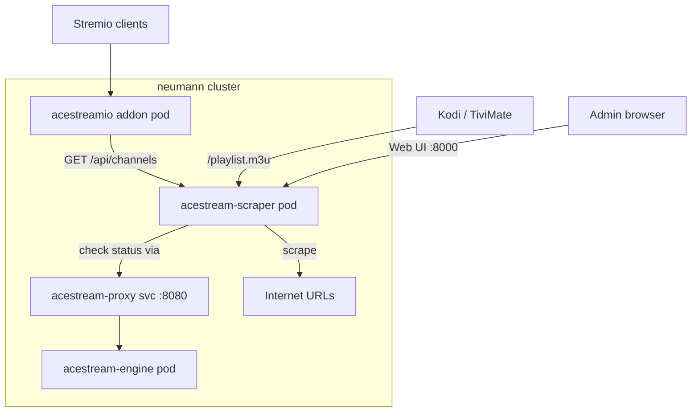

# Acestream Scraper Integration Plan

## Context

The acestreamio Stremio addon currently has a static channel list (`list.js`, 205 channels) baked into the Docker image. Channels are unreliable (P2P peer availability varies), and updating the list requires a full addon release cycle. We need:

1. **Channel discovery** — Automatically scrape/discover acestream channels from multiple sources
2. **Health checking** — Probe infohashes against the acestream engine to determine liveness
3. **Decoupled releases** — Update the channel list without redeploying the addon
4. **M3U generation** — Serve playlists for Kodi/TiviMate directly from the channel engine

## Decision: Fork `pipepito/acestream-scraper`

Rather than building from scratch, we fork [Pipepito/acestream-scraper](https://github.com/Pipepito/acestream-scraper) (MIT license, Python/Flask/BeautifulSoup/SQLAlchemy) which already provides:

- URL scraping with configurable sources (HTML, JSON, M3U)
- Channel status checking against acestream engine API
- M3U playlist generation (`/playlist.m3u`)
- SQLAlchemy persistence with migrations
- Web UI for channel/URL management
- Auto-rescraping on configurable intervals
- Docker image, health endpoint, OpenAPI docs
- Optional ZeroNet + Cloudflare WARP support

## Architecture



### Data flow

1. **Scraper** periodically fetches configured URLs, extracts acestream infohashes + metadata
2. **Health checker** probes each infohash via `acestream-proxy` → engine (`/ace/getstream?id=HASH&format=json`)
3. **Store** persists channels with status (alive/dead/unknown), last checked, first discovered
4. **API** serves flat channel list with status to acestreamio addon
5. **M3U** endpoint generates playlists from alive channels for Kodi/TiviMate
6. **Addon** fetches channels from scraper API, groups by `channel_name` for Stremio UX

### Flat data model (what the scraper stores per channel)

```json
{
  "infohash": "102bcb79ca391e37ac1fc9ee77dc53440d0a59ce",
  "channel_name": "M+ Acción HD",
  "stream_name": "NEW ERA",
  "title": "MOVISTAR ACCION FHD --> NEW ERA",
  "category": "MOVISTAR",
  "logo": "https://...",
  "source": "playlist-newera.m3u",
  "status": "alive",
  "last_checked": "2026-02-17T21:00:00Z",
  "last_seen_alive": "2026-02-17T21:00:00Z",
  "response_time_ms": 450,
  "first_discovered": "2026-02-15T10:00:00Z"
}
```

Grouping by `channel_name` into variants is a **presentation concern** handled by the consumer (addon groups for Stremio, M3U keeps flat).

## Implementation Phases

### Phase 1: Deploy acestream-scraper alongside existing stack
- Fork `pipepito/acestream-scraper` to `tonioriol/acestream-scraper`
- Remove embedded acestream engine + Acexy (we have our own)
- Configure `ace_engine_url` to point at our acestream-proxy ClusterIP service
- Seed initial data from current `list.js` (205 channels)
- Add/verify REST API endpoint for addon consumption (`GET /api/channels` with status)
- Configure scraping sources (existing M3U playlist URLs, acestreamid.com)
- Create Helm chart `charts/acestream-scraper/` in ritchie repo
- Create ArgoCD Application `apps/acestream-scraper.yaml`
- Deploy and verify scraping + health checks work

### Phase 2: Connect addon to scraper
- Refactor acestreamio `addon.js` to fetch channels from scraper API instead of static `list.js`
- Cache channel data in memory with TTL (e.g., 60s)
- Keep `list.js` as fallback if scraper is unreachable
- `server.js` proxies `/playlist.m3u` to scraper or generates from cached data

### Phase 3: Cleanup
- Remove `list.js`, `converter.js`, `buildM3U()` from acestreamio
- Remove playlist files from `playlists/` directory
- Optional: expose acestream-scraper web UI via Cloudflare tunnel for remote admin

## Helm Chart: `charts/acestream-scraper/`

```yaml
# values.yaml
image:
  repository: ghcr.io/tonioriol/acestream-scraper  # or pipepito/acestream-scraper initially
  tag: latest
  pullPolicy: Always

replicaCount: 1

service:
  port: 8000

env:
  aceEngineUrl: "http://acestream-proxy:8080"
  rescrapeInterval: 30  # minutes
  flaskPort: 8000

persistence:
  enabled: true
  size: 1Gi
  storageClass: ""  # use default

ingress:
  enabled: false  # use cloudflare tunnel if needed
```

## Key Configuration

The scraper's `config.json` will be:
```json
{
  "urls": [
    "https://raw.githubusercontent.com/.../playlist.m3u",
    "https://acestreamid.com/"
  ],
  "base_url": "http://acestream-proxy:8080/ace/getstream?id=",
  "ace_engine_url": "http://acestream-proxy:8080",
  "rescrape_interval": 30
}
```
